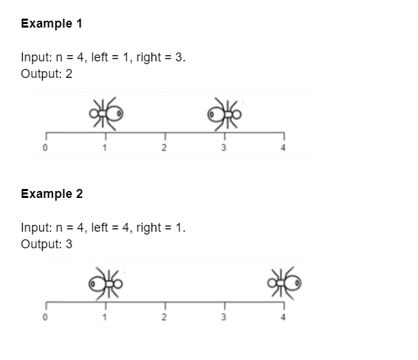
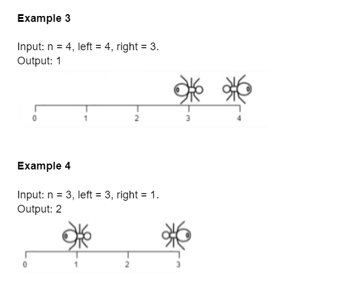

```
We have a wooden plank of the length n units.  
Two ants are walking on the plank,  
each ant moves with a speed of 1 unit per round.  
One ant moves to the left, the other moves to the right.  
At one round, each ant makes a move.  
Ant walking to the left moves first.
```
У нас есть деревянная доска длиной n единиц.  
По доске ходят два муравья, каждый муравей движется со скоростью 1 единица за раунд.  
Один муравей движется влево, другой вправо.  
В одном раунде каждый муравей делает ход.  
Муравей, идущий влево, движется первым.


If an ant is going to move to a point that is already occupied by another ant,  
then each of the ants change direction and only after that the current ant moves.  
Assume changing directions does not take any additional round.  
Also, ants cannot take the same position on the plank.

Если муравей собирается переместиться в точку, которая уже занята другим муравьем,  
то каждый из муравьев меняет направление и только после этого движется текущий муравей.  
Предположим, что изменение направления не требует дополнительного раунда.  
Кроме того, муравьи не могут занять одно и то же положение на доске.


When an ant reaches one end of the plank and moves towards the end of the plank,  
it does not fall out of the plank immediately,  
it happens in the next round.

Когда муравей достигает одного конца доски и движется к концу доски,  
он не выпадает из доски сразу, это происходит в следующем раунде.


Given an integer n — plank length and two integers:  
left — the position of the ant which moves to the left and  
right — the position of the ant which moves to the right.  
Return number of rounds needed to get the first ant falls out of the plank.

Даны целое число n — длина доски и два целых числа:  
left — позиция муравья, который движется влево, и  
right — позиция муравья, который движется вправо.  
Возвращает количество раундов, необходимое для того, чтобы первый муравей выпал из доски.


Constraints:  
1 <= n <= 10^4  
0 <= left <= n  
0 <= right <= n  
left != right





